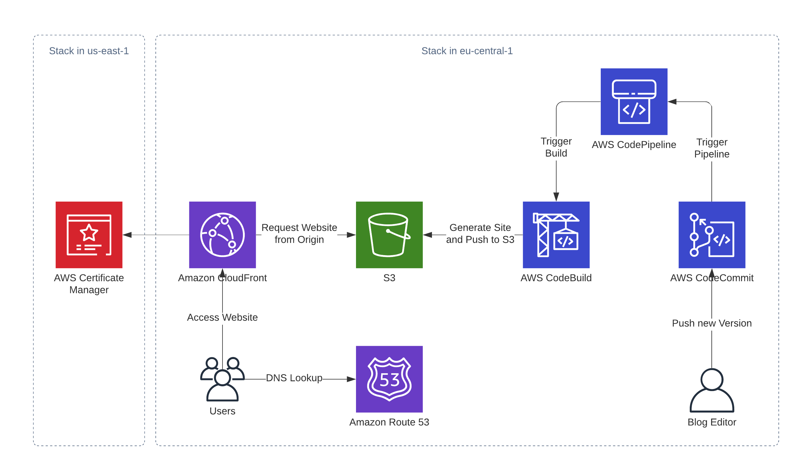

# Static Website with a build pipeline

> This is code has an accompanying [blog article TODO](https://aws-blog.de/2020/03/building-a-fargate-based-container-app-with-cognito-authentication.html) which I highly recommend you check out before deploying it.

## Introduction

This CDK app sets up the infrastructure for a static website built with Hugo and distributed by CloudFront. It includes the whole serverless pipeline to build and deploy new versions of the website.

## Architecture



This stack builds up a bunch of things:

- An S3 Bucket that hosts the website
- A CloudFront distribution with the above mentioned bucket as its origin
- A CodeCommit repository to store the source of the website
- A Code Pipeline including CodeBuild to automatically build new versions of the website


## Prerequisites

- CDK is installed
- Python >= 3.6 is installed
- You have a public hosted zone in your account

## Steps to deploy

1. Check out the repo
2. Navigate to this directory
3. Create a new python virtual environment, e.g. `python3 -m venv .env`
4. Activate the environment using `source .env/bin/activate` on Mac or Linux or run `source.bat` on Windows.
5. Open `python-static-website-with-hugo-codepipeline-and-cloudfron/app.py` and edit these variables as described in the [blog article](https://aws-blog.de/2020/03/building-a-fargate-based-container-app-with-cognito-authentication.html):

    ```python
    WEBSITE_DOMAIN_NAME = "blog.mb-trc.de"
    HOSTED_ZONE_ID = "ZECQVEY17GSI4"
    HOSTED_ZONE_NAME = "mb-trc.de"
    ```

6. Run `cdk synth` to check if the CDK works as expected, you can inspect the template if you're curious.
7. Run `cdk deploy` to deploy the resources. 


Run `cdk deploy certificate-stack` then look at the outputs and note the Certificate ARN.

The Output should look something like this

```text
Outputs:
certificate-stack.CertificateArn = arn:aws:acm:us-east-1:123123212312:certificate/4d45bfb4-19f4-4dbd-8cd6-b510f4fdf8b4
```

Edit the `app.py` and insert the Certificate ARN from the previous step in the Variable `CLOUDFRONT_CERTIFICATE_ARN`.

Then run `cdk deploy static-website-stack` and note the output of the repo clone URL.